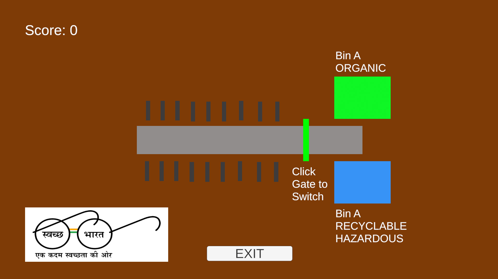
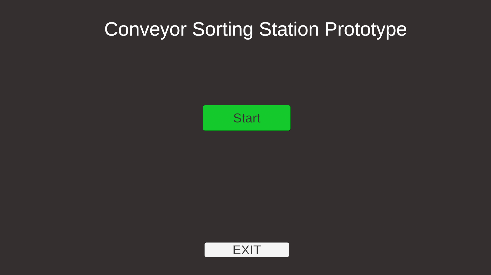

# Conveyor Sorting Prototype

A small Unity 2D sorting game prototype focused on gameplay logic, player input, item routing, and progressive difficulty.

## Screenshots

### Gameplay

### Sorting

### Start Screen

## Features

- Randomized item spawning
- Three item types: Organic, Recyclable, and Hazardous
- Interactive sorting gate
- Route-based item movement
- Trigger-based bin validation
- Correct and incorrect sorting feedback
- Score system
- Increasing item speed based on score
- Start screen and quit control

## Tech

- Unity 6
- C#
- Unity New Input System
- TextMeshPro
- Git / GitHub

## Controls

- Left Mouse Button — Switch sorting gate
- Start Screen — Start / Quit

## Project

This is a small gameplay prototype rather than a complete commercial game. The project was built to practice implementing gameplay systems involving input, spawning, routing, collision detection, scoring, and difficulty progression.